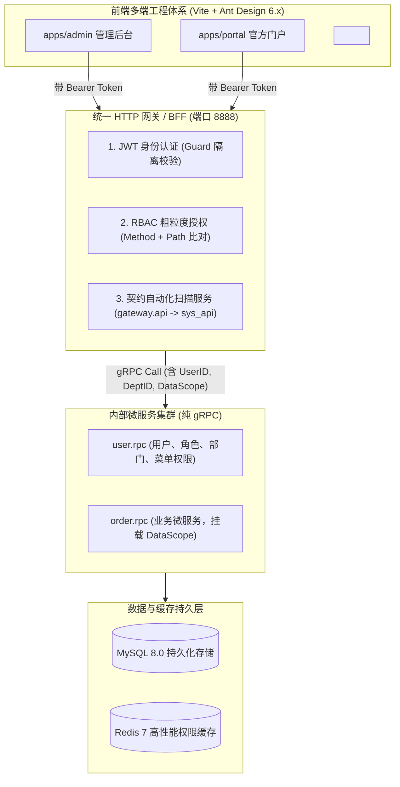
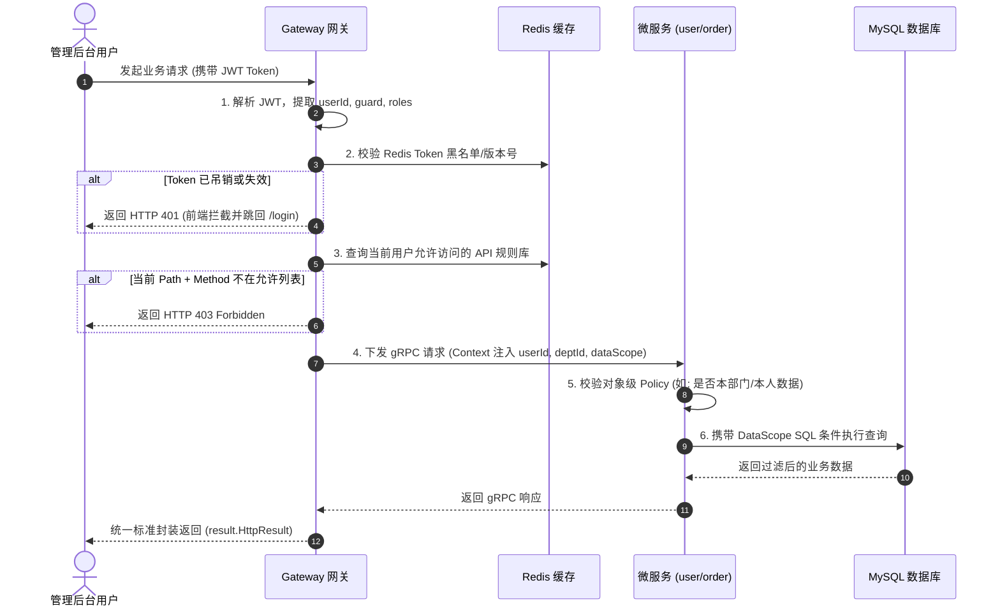
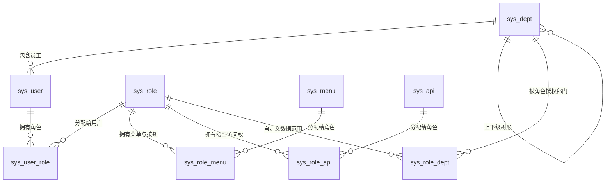

# 企业级全栈 RBAC 与数据权限体系设计方案

> **文档版本**：v1.0.0  
> **创建日期**：2026-09-06  
> **文档路径**：`doc/design/2026-09-06-permission/README.md`  
> **设计目标**：为 `go-zero-boilerplate` 构建融合 PHP 成熟生态精髓的工业级、自动化、全栈权限管理体系（包含功能权限、数据范围权限、契约自动化扫描与 Ant Design Pro 动态前端）。

---

## 1. 设计背景与核心痛点

本项目基于 **Fullstack Monorepo（统一 HTTP 网关 + 纯 gRPC 业务微服务 + pnpm workspace 前端）** 架构。原有的登录模块仅完成了基础的“用户名/密码哈希校验 + JWT 签发与解析”，尚未具备生产级企业中后台所必须的权限管理能力。

### 1.1 经典 RBAC 的局限性与参考 PHP 生态的 5 大升级

传统 Java/Go 体系常采用基础的 **RBAC96** 模型（用户-角色-权限），在实际工程中存在诸多痛点。本方案深度融合并吸收了 **PHP 成熟生态（FastAdmin、Laravel-Permission、ThinkPHP Auth）** 打磨十余年的核心精髓，进行升维优化：

| 优化维度 | 传统 RBAC96 痛点 | 借鉴 PHP 生态的解法 | 在本项目中的最佳实践 |
| :--- | :--- | :--- | :--- |
| **API 接口维护** | 纯人肉录入 `sys_api`，极易与代码脱节 | 控制器/注解自反射自动扫描 | **契约驱动自动逆向**：从 `desc/*.api` 一键自动同步网关路由字典，零人工维护 |
| **数据范围权限** | 仅控制“能否点按钮/调接口”，管不了“能看谁的数据” | Spatie / FastAdmin 数据作用域（Data Scope） | **数据权限规则注入**：引入部门树 `sys_dept`，在 RPC Model 层动态拼接行级过滤 |
| **多用户体系** | 前后台共用一张表，存在越权与串号隐患 | Laravel Multi-Guards（多守卫体系） | **物理隔离**：拆分后台员工 `sys_user` 与 C 端会员 `user`，JWT 隔离鉴权 |
| **动态对象鉴权** | 无法处理“只能取消自己的未支付订单”等业务约束 | Laravel Gate & Policy 策略闭包 | **粗细粒度解耦**：网关只做粗粒度 403 路由拦截，微服务 Logic 做细粒度 ABAC 闭环 |
| **前端开发效率** | 复杂的动态路由与权限指令手写样板代码多 | 声明式资源管理 (Resource / Schema) | **ProComponents 生产力**：`ProLayout` 动态挂载后端菜单树 + `<Access />` 按钮组件 |

---

## 2. 总体架构设计与时序流转

### 2.1 整体架构拓扑



### 2.2 鉴权与业务执行时序



---

## 3. 数据库与领域模型设计 (Data Models)

### 3.1 实体关系模型 (ER Diagram)



### 3.2 完整生产级 MySQL DDL

```sql
-- ====================================================================
-- 企业级 RBAC 与数据权限完整数据表结构
-- ====================================================================

-- 1. 组织机构 / 部门表 (支持层级树形与数据权限范围)
CREATE TABLE IF NOT EXISTS `sys_dept` (
    `id` bigint NOT NULL AUTO_INCREMENT COMMENT '部门ID',
    `parent_id` bigint NOT NULL DEFAULT 0 COMMENT '父部门ID (0为顶级)',
    `ancestors` varchar(500) NOT NULL DEFAULT '' COMMENT '祖级列表 (如: 0,1,5，便于层级检索)',
    `dept_name` varchar(50) NOT NULL COMMENT '部门名称',
    `sort` int NOT NULL DEFAULT 0 COMMENT '显示顺序',
    `leader` varchar(50) NOT NULL DEFAULT '' COMMENT '负责人',
    `phone` varchar(20) NOT NULL DEFAULT '' COMMENT '联系电话',
    `status` tinyint NOT NULL DEFAULT 1 COMMENT '状态 (1:正常 0:停用)',
    `create_time` datetime NOT NULL DEFAULT CURRENT_TIMESTAMP,
    `update_time` datetime NOT NULL DEFAULT CURRENT_TIMESTAMP ON UPDATE CURRENT_TIMESTAMP,
    PRIMARY KEY (`id`),
    KEY `idx_parent_id` (`parent_id`)
) ENGINE=InnoDB DEFAULT CHARSET=utf8mb4 COMMENT='组织机构部门表';

-- 2. 管理后台员工/用户表 (与前台 C 端 user 表物理隔离)
CREATE TABLE IF NOT EXISTS `sys_user` (
    `id` bigint NOT NULL AUTO_INCREMENT COMMENT '员工ID',
    `dept_id` bigint NOT NULL DEFAULT 0 COMMENT '归属部门ID',
    `username` varchar(50) NOT NULL COMMENT '登录账号',
    `password` varchar(100) NOT NULL COMMENT '密码哈希 (Bcrypt)',
    `real_name` varchar(50) NOT NULL DEFAULT '' COMMENT '真实姓名',
    `mobile` varchar(20) NOT NULL DEFAULT '' COMMENT '手机号码',
    `email` varchar(100) NOT NULL DEFAULT '' COMMENT '用户邮箱',
    `avatar` varchar(255) NOT NULL DEFAULT '' COMMENT '用户头像',
    `status` tinyint NOT NULL DEFAULT 1 COMMENT '账号状态 (1:正常 0:停用)',
    `token_version` int NOT NULL DEFAULT 1 COMMENT 'Token版本号 (用于强制下线/密码重置吊销)',
    `create_time` datetime NOT NULL DEFAULT CURRENT_TIMESTAMP,
    `update_time` datetime NOT NULL DEFAULT CURRENT_TIMESTAMP ON UPDATE CURRENT_TIMESTAMP,
    PRIMARY KEY (`id`),
    UNIQUE KEY `idx_username` (`username`),
    KEY `idx_dept_id` (`dept_id`),
    KEY `idx_mobile` (`mobile`)
) ENGINE=InnoDB DEFAULT CHARSET=utf8mb4 COMMENT='管理后台系统用户表';

-- 3. 角色表 (包含功能权限与数据权限定义)
CREATE TABLE IF NOT EXISTS `sys_role` (
    `id` bigint NOT NULL AUTO_INCREMENT COMMENT '角色ID',
    `name` varchar(50) NOT NULL COMMENT '角色名称 (如: 销售总监)',
    `code` varchar(50) NOT NULL COMMENT '角色字符 (如: ROLE_SALES_DIRECTOR)',
    `sort` int NOT NULL DEFAULT 0 COMMENT '显示顺序',
    `data_scope` tinyint NOT NULL DEFAULT 1 COMMENT '数据范围 (1:全部 2:自定义部门 3:本部门 4:本部门及以下 5:仅本人)',
    `status` tinyint NOT NULL DEFAULT 1 COMMENT '角色状态 (1:正常 0:停用)',
    `description` varchar(255) NOT NULL DEFAULT '' COMMENT '备注描述',
    `create_time` datetime NOT NULL DEFAULT CURRENT_TIMESTAMP,
    `update_time` datetime NOT NULL DEFAULT CURRENT_TIMESTAMP ON UPDATE CURRENT_TIMESTAMP,
    PRIMARY KEY (`id`),
    UNIQUE KEY `idx_code` (`code`)
) ENGINE=InnoDB DEFAULT CHARSET=utf8mb4 COMMENT='系统角色表';

-- 4. 菜单与权限项字典表 (支持目录、菜单、按钮权限三级树)
CREATE TABLE IF NOT EXISTS `sys_menu` (
    `id` bigint NOT NULL AUTO_INCREMENT COMMENT '菜单/权限ID',
    `parent_id` bigint NOT NULL DEFAULT 0 COMMENT '父菜单ID (0为根目录)',
    `title` varchar(50) NOT NULL COMMENT '菜单标题',
    `type` tinyint NOT NULL COMMENT '类型 (1:目录 2:菜单 3:按钮/权限点)',
    `path` varchar(200) NOT NULL DEFAULT '' COMMENT '前端路由地址 (如: /system/users)',
    `component` varchar(255) NOT NULL DEFAULT '' COMMENT '前端组件路径 (如: System/Users)',
    `permission_code` varchar(100) NOT NULL DEFAULT '' COMMENT '权限标识符 (如: system:user:add)',
    `icon` varchar(100) NOT NULL DEFAULT '' COMMENT '图标标识',
    `sort` int NOT NULL DEFAULT 0 COMMENT '排序',
    `visible` tinyint NOT NULL DEFAULT 1 COMMENT '菜单是否显示 (1:显示 0:隐藏)',
    `status` tinyint NOT NULL DEFAULT 1 COMMENT '菜单状态 (1:正常 0:停用)',
    `create_time` datetime NOT NULL DEFAULT CURRENT_TIMESTAMP,
    `update_time` datetime NOT NULL DEFAULT CURRENT_TIMESTAMP ON UPDATE CURRENT_TIMESTAMP,
    PRIMARY KEY (`id`),
    KEY `idx_parent_id` (`parent_id`)
) ENGINE=InnoDB DEFAULT CHARSET=utf8mb4 COMMENT='系统菜单与按钮权限表';

-- 5. API 资源表 (与网关契约 gateway.api 联动自动化逆向生成)
CREATE TABLE IF NOT EXISTS `sys_api` (
    `id` bigint NOT NULL AUTO_INCREMENT COMMENT '接口ID',
    `api_group` varchar(50) NOT NULL COMMENT '所属业务域/分组 (如: user, order, system)',
    `title` varchar(100) NOT NULL COMMENT '接口名称描述',
    `path` varchar(200) NOT NULL COMMENT '网关路由 (如: /api/v1/user/info)',
    `method` varchar(10) NOT NULL COMMENT '请求方式 (GET, POST, PUT, DELETE)',
    `is_auto_sync` tinyint NOT NULL DEFAULT 1 COMMENT '是否契约自动同步生成 (1:是 0:人工维护)',
    `create_time` datetime NOT NULL DEFAULT CURRENT_TIMESTAMP,
    `update_time` datetime NOT NULL DEFAULT CURRENT_TIMESTAMP ON UPDATE CURRENT_TIMESTAMP,
    PRIMARY KEY (`id`),
    UNIQUE KEY `idx_path_method` (`path`, `method`)
) ENGINE=InnoDB DEFAULT CHARSET=utf8mb4 COMMENT='网关后端接口资源表';

-- 6. 关联表结构定义
CREATE TABLE IF NOT EXISTS `sys_user_role` (
    `id` bigint NOT NULL AUTO_INCREMENT,
    `user_id` bigint NOT NULL COMMENT '用户ID',
    `role_id` bigint NOT NULL COMMENT '角色ID',
    PRIMARY KEY (`id`),
    UNIQUE KEY `idx_user_role` (`user_id`, `role_id`)
) ENGINE=InnoDB DEFAULT CHARSET=utf8mb4 COMMENT='用户角色关联表';

CREATE TABLE IF NOT EXISTS `sys_role_menu` (
    `id` bigint NOT NULL AUTO_INCREMENT,
    `role_id` bigint NOT NULL COMMENT '角色ID',
    `menu_id` bigint NOT NULL COMMENT '菜单/权限ID',
    PRIMARY KEY (`id`),
    UNIQUE KEY `idx_role_menu` (`role_id`, `menu_id`)
) ENGINE=InnoDB DEFAULT CHARSET=utf8mb4 COMMENT='角色菜单/权限关联表';

CREATE TABLE IF NOT EXISTS `sys_role_api` (
    `id` bigint NOT NULL AUTO_INCREMENT,
    `role_id` bigint NOT NULL COMMENT '角色ID',
    `api_id` bigint NOT NULL COMMENT '接口ID',
    PRIMARY KEY (`id`),
    UNIQUE KEY `idx_role_api` (`role_id`, `api_id`)
) ENGINE=InnoDB DEFAULT CHARSET=utf8mb4 COMMENT='角色API权限关联表';

CREATE TABLE IF NOT EXISTS `sys_role_dept` (
    `id` bigint NOT NULL AUTO_INCREMENT,
    `role_id` bigint NOT NULL COMMENT '角色ID',
    `dept_id` bigint NOT NULL COMMENT '部门ID',
    PRIMARY KEY (`id`),
    UNIQUE KEY `idx_role_dept` (`role_id`, `dept_id`)
) ENGINE=InnoDB DEFAULT CHARSET=utf8mb4 COMMENT='角色自定义数据范围部门关联表';
```

---

## 4. 后端与网关核心实现机制

### 4.1 契约驱动 API 自动逆向扫描器 (解决人肉维护痛点)

利用现有工具链，在执行 `just gen-gateway` 或自动化发布时，通过脚本自动扫描 `app/gateway/desc/*.api` 文件：
1. 正则或 AST 解析 `@server`、`@handler`、`@doc` 与路由声明；
2. 提取 `api_group`（如 `user`）、`title`（如 `@doc "用户注册"`）、`method`（`post`）、`path`（`/api/v1/user/register`）；
3. 执行 `INSERT INTO sys_api ... ON DUPLICATE KEY UPDATE` 写入数据库。
* **效果**：开发者只要在 `.api` 契约中定义完接口，管理后台的“API 资源列表”与“角色授权抽屉”便**自动出现该接口**，0 人工沟通成本与同步遗漏。

### 4.2 网关鉴权中间件与 Redis 权限缓存

在 `app/gateway/gateway.go` 中注入授权中间件：

```go
func AuthorityMiddleware(userRpc userClient.User, redisConn *redis.Redis) rest.Middleware {
    return func(next http.HandlerFunc) http.HandlerFunc {
        return func(w http.ResponseWriter, r *http.Request) {
            // 1. 获取当前用户 ID
            userId := extractUserId(r.Context())
            if userId <= 0 {
                httpx.WriteJsonCtx(r.Context(), w, http.StatusUnauthorized, result.Error(xerr.TokenExpireError, "未授权"))
                return
            }

            // 2. 超管直接放行
            if isSuperAdmin(r.Context()) {
                next(w, r)
                return
            }

            // 3. 从 Redis 获取该用户允许调用的 API 签名集合 Set ("POST:/api/v1/user/info")
            cacheKey := fmt.Sprintf("cache:auth:apis:%d", userId)
            currentSign := fmt.Sprintf("%s:%s", r.Method, r.URL.Path)
            
            allowed, err := redisConn.Sismember(cacheKey, currentSign)
            if err == nil && allowed {
                next(w, r)
                return
            }

            // 4. 无权限返回 HTTP 403 Forbidden
            httpx.WriteJsonCtx(r.Context(), w, http.StatusForbidden, result.Error(xerr.AccessForbidden, "无接口访问权限"))
        }
    }
}
```

### 4.3 数据权限作用域 (Data Scope) 在微服务中的落地

在业务微服务（如 `order.rpc`）执行列表查询时，结合当前用户的 `data_scope`：

```go
// OrderModelCustom.go
func (m *customOrdersModel) BuildDataScopeFilter(ctx context.Context, scope int, userDeptId int64, currentUserId int64) string {
    switch scope {
    case 1: // 全部数据权限
        return "1=1"
    case 3: // 本部门数据权限
        return fmt.Sprintf("dept_id = %d", userDeptId)
    case 4: // 本部门及以下数据权限
        return fmt.Sprintf("dept_id IN (SELECT id FROM sys_dept WHERE id = %d OR FIND_IN_SET(%d, ancestors))", userDeptId, userDeptId)
    case 5: // 仅本人数据权限
        return fmt.Sprintf("user_id = %d", currentUserId)
    default:
        return "1=2" // 无权限兜底
    }
}
```

---

## 5. 前端 Ant Design Pro 落地实现

### 5.1 动态菜单与动态路由 (Dynamic ProLayout)

在 `apps/admin/src/layouts/BasicLayout.tsx` 中，将静态的 `routeConfig` 切换为接口动态下发：

```tsx
<ProLayout
  {...settings}
  // 动态由网关获取当前用户拥有的菜单树 (过滤掉 type === 3 的按钮)
  menu={{
    params: { userId: currentUser?.id },
    request: async () => {
      const menus = await getUserMenuTree();
      return transformToProMenu(menus);
    },
  }}
  menuItemRender={(item, dom) => (
    <div onClick={() => item.path && navigate(item.path)}>
      {dom}
    </div>
  )}
>
  <Outlet />
</ProLayout>
```

### 5.2 按钮级权限控制组件 (`<Access />`)

在 `apps/admin/src/components/Access.tsx` 封装权限高阶组件：

```tsx
import React from 'react';
import { useAuth } from '../contexts/AuthContext';

interface AccessProps {
  permission: string | string[];
  fallback?: React.ReactNode;
  children: React.ReactNode;
}

export const Access: React.FC<AccessProps> = ({ permission, fallback = null, children }) => {
  const { permissions, isSuperAdmin } = useAuth();

  if (isSuperAdmin) {
    return <>{children}</>;
  }

  const requiredList = Array.isArray(permission) ? permission : [permission];
  const hasAuth = requiredList.some(code => permissions.includes(code));

  return hasAuth ? <>{children}</> : <>{fallback}</>;
};

// 页面中使用示范：
<Access permission="system:user:add">
  <Button type="primary" icon={<PlusOutlined />}>新增员工</Button>
</Access>
```

### 5.3 ProComponents CRUD 标准交互示范

依托已经搭载的 `@ant-design/pro-components`，四大模块的生产力大幅提升：
1. **用户管理 (`/system/users`)**：
   * `<ProTable<SysUserItem> />`：支持部门树树形穿梭过滤、状态快捷开关（Switch）、批量重置密码；
   * `<ModalForm />`：新增/编辑员工，支持表单分组联动。
2. **角色管理 (`/system/roles`)**：
   * `<ProTable<SysRoleItem> />`：列表展示；
   * 点击“授权”弹窗：使用 Ant Design `<Tree checkable />` 展示菜单权限树，右侧展示 API 资源树，支持一键全选/联动选择。
3. **菜单管理 (`/system/menus`)**：
   * 表格直接设置 `expandable` 树形嵌套展示；
   * 区别渲染“目录 / 菜单 / 按钮”高亮 Tag 标签，直观维护 `permission_code`。
4. **接口字典 (`/system/apis`)**：
   * 支持通过按钮“一键从网关同步”，自动比对代码库中的最新 `.api` 文件与数据库差异。

---

## 6. 分阶段落地路线图 (Implementation Roadmap)

本方案作为大仓权限演进的标准指南，建议按以下里程碑实施：

* [ ] **Phase 1: 数据库与持久层就绪**
  * 在 `manifest/sql/rbac.sql` 中提交上述 DDL；
  * 执行 `just gen-model` 生成各实体带 Redis 缓存的 Go Model。
* [ ] **Phase 2: 微服务与契约生成**
  * 扩展 `app/user/rpc/user.proto`，提供角色、菜单、部门的 RPC 方法（使用 `m.Trans` 保证事务原子性）；
  * 编写 `app/gateway/desc/sys_*.api` 契约，执行 `just gen-gateway` 和 `just gen-ts`。
* [ ] **Phase 3: 网关拦截与数据权限下沉**
  * 编写网关 API 自动逆向扫描脚本（`hack/scripts/sync-apis.go`）；
  * 在网关挂载 RBAC 校验中间件；在业务微服务接入 `DataScope` 过滤。
* [ ] **Phase 4: 前端 ProTable 与动态权限拼装**
  * 编写前端动态路由拦截与 `<Access />` 权限指令；
  * 完成用户、角色、菜单、接口四大 ProTable 页面。