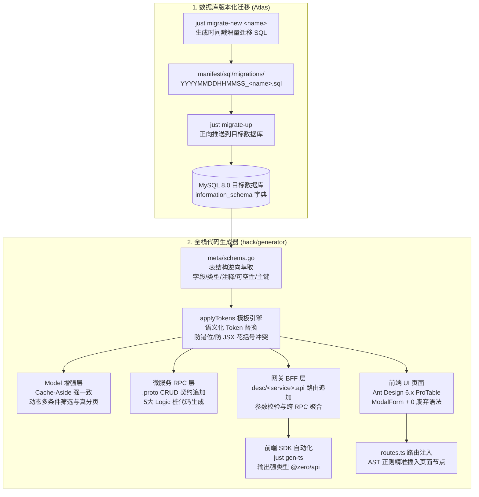

# 全栈 CRUD 代码生成器与数据库版本化迁移流水线设计方案

> **文档版本**：v1.0.0  
> **更新日期**：2026-09-12  
> **文档路径**：`doc/design/2026-09-12-crud-and-migrations/README.md`  
> **设计目标**：为 `go-zero-boilerplate` 构建由 MySQL DDL / 实体表结构驱动的一键式全栈代码生成流水线，打通“数据库增量迁移 -> Model (Cache-Aside + 动态分页) -> 微服务 RPC -> 网关 BFF -> 前端 TS SDK -> Ant Design 6.x ProTable”端到端闭环，彻底消除重复样板代码与数据库版本漂移风险。

---

## 1. 架构背景与核心痛点

在企业级全栈微服务体系中，新增一个基础业务实体（如岗位管理 `sys_post`、通知公告 `sys_notice` 等）往往涉及繁琐且割裂的机械劳动：
1. **数据库结构漂移**：缺少版本化、可追踪的 Schema 迁移机制，开发环境、测试环境与生产环境靠手动互导 SQL，容易发生漏表、漏字段事故。
2. **多层契约重复编写**：
   - 编写 MySQL DDL 表结构；
   - 编写微服务 Model，处理复杂的分页、Count、多条件过滤；
   - 编写 Protobuf `.proto` 消息体与 RPC 接口，并手动调用生成；
   - 编写网关 `desc/*.api` 契约，暴露 RESTful 路由并绑定 RPC 客户端；
   - 刷新前端 TypeScript SDK；
   - 编写符合 Ant Design 6.x 规范的 React 页面（包含筛选表单、ProTable 列、新建/编辑 ModalForm、删除确认与国际化）。
3. **传统生成器脆弱性**：基于位置占位符（如 `fmt.Sprintf` 含有十几个 `%s`）极易由于新增字段产生参数错位；Go 模板引擎解析 JSX 内联对象时容易产生双花括号 `{{ }}` 冲突。

为此，本项目基于工业级实践设计并实现了由 **Atlas 迁移引擎** 与 **Token-Driven AST 代码生成器** 组成的自动化流水线。

---

## 2. 总体架构与数据流转



---

## 3. 数据库版本化迁移工作流 (Atlas)

采用 [Atlas](https://atlasgo.io) 作为脚手架数据库迁移标准工具：

### 3.1 目录结构与配置规范
* **配置文件**：根目录 [atlas.hcl](file:///D:/work/go-zero-boilerplate/atlas.hcl)，声明数据库连接字符串与迁移目录。
* **迁移清单**：位于 [manifest/sql/migrations/](file:///D:/work/go-zero-boilerplate/manifest/sql/migrations/)：
  - `20260912000000_baseline.sql`：全量基线架构（包含 RBAC、双日志、数据字典、订单等）。
  - `20260912000001_create_sys_post.sql`：增量业务迁移示例。
  - `atlas.sum`：自动生成的迁移文件哈希校验和，防止团队协作时恶意或意外篡改历史迁移记录。

### 3.2 常用迁移命令
```bash
# 创建增量迁移脚本文件模板
just migrate-new create_sys_notice

# 执行未应用的增量迁移（正向升级）
just migrate-up

# 回滚最近一个迁移版本
just migrate-down

# 查看当前迁移同步状态（已执行/待执行版本与执行耗时）
just migrate-status
```

---

## 4. 代码生成引擎核心设计 (`hack/generator`)

### 4.1 元数据萃取与智能映射 (`meta/`)
生成器通过执行 SQL 查询 MySQL `information_schema.COLUMNS` 与 `TABLES`：
1. **字段信息提取**：获取 `column_name`、`data_type`、`column_comment`、`is_nullable`、`column_key`。
2. **类型智能转换**：
   - MySQL `bigint` -> Go `int64` -> TS `number` -> Proto `int64`
   - MySQL `varchar/text` -> Go `string` -> TS `string` -> Proto `string`
   - MySQL `tinyint/int` -> Go `int64` -> TS `number` -> Proto `int64`
   - MySQL `timestamp/datetime` -> Go `time.Time` -> TS `string` -> Proto `string`
3. **命名转换防护**：
   - 特别处理 `id` 与 `parent_id`：goctl 规范统一生成为 `Id` 与 `ParentId`，生成器严格对齐（Go 字段 `Id`，JSON/Proto 标签 `id`，TS 属性 `id`）。

### 4.2 语义化 Token 替换引擎 (`applyTokens`)
彻底淘汰 `fmt.Sprintf` 中极易错位的 `%s` 模式，引入明确的语义占位符：
```go
func applyTokens(tmpl string, tokens map[string]string) string {
    res := tmpl
    for k, v := range tokens {
        res = strings.ReplaceAll(res, k, v)
    }
    return res
}
```
关键 Token 包含：
- `{{EntityName}}`：实体大驼峰（如 `SysPost`）
- `{{entityName}}`：实体小驼峰（如 `sysPost`）
- `{{EntitySnake}}`：实体下划线（如 `sys_post`）
- `{{EntityKebab}}`：实体短横线（如 `sys-post`）
- `{{EntityComment}}`：实体中文名称（如 `岗位信息`）
- `{{ToPbCode}}` / `{{FromPbCode}}`：对象互转赋值代码块

### 4.3 JSX 语法解析保护
在前端 ProTable 模板中，React 内联样式或对象的双花括号（如 `header={{ title: "..." }}`）会被 Go 原生 `text/template` 引擎误认为模板 Action。生成器模板中统一规范为 `header={ { title: "..." } }`（中间加入单空格），完美规避模板解析 Panic。

---

## 5. 端到端各层代码规范

### 5.1 微服务 Model 层 (Cache-Aside + 动态分页)
在 `<entity>_model.go` 中自动扩展：
* **Count 方法**：动态拼接筛选条件，使用 `session.QueryRowCtx` 统计总量。
* **List 方法**：动态拼接 `ORDER BY id DESC LIMIT ? OFFSET ?`，返回实体切片。
* **缓存一致性**：单条查询优先命中 Redis 缓存；更新与删除走 `CachedConn` 自动淘汰缓存 Key。

### 5.2 微服务 RPC 层
* **契约更新**：在 `app/<service>/rpc/<service>.proto` 自动追加：
  - `Create<Entity>Req` / `Create<Entity>Resp`
  - `Update<Entity>Req` / `Update<Entity>Resp`
  - `Delete<Entity>Req` / `Delete<Entity>Resp`
  - `Get<Entity>Req` / `Get<Entity>Resp`
  - `List<Entity>Req` / `List<Entity>Resp`
* **RPC Logic**：自动生成 5 大 Logic 桩代码，自动注入 Model 依赖与上下文。

### 5.3 网关 BFF 层
* **契约更新**：在 `app/gateway/desc/<service>.api` 自动追加 RESTful 路由并指定鉴权切面（`jwt: Auth`、`middleware: RbacMiddleware`）。
* **Logic/Handler**：生成调用下游微服务 RPC Client 的标准代码，使用 `pkg/result` 输出。

### 5.4 前端 SDK 与 ProTable 页面
* **SDK 同步**：自动调用 `just gen-ts` 将接口同步至 `@zero/api`。
* **ProTable 页面**：输出于 `frontend/apps/admin/src/pages/<EntityName>/index.tsx`：
  - 遵循 Ant Design 6.x 规范，0 废弃语法。
  - 集成 `PageContainer` 容器与 `useIntl` 国际化。
  - 集成 `ModalForm`（支持新建与编辑复用）。
  - 集成 `Popconfirm` 气泡确认与删除操作。
* **路由自动注入**：自动在 `frontend/apps/admin/src/config/routes.ts` 的系统管理或业务菜单下挂载路由节点。

---

## 6. 实战验证基准 (`sys_post`)

以系统岗位表 `sys_post` 作为全流程端到端检验实体：
1. **迁移执行**：`just migrate-up` 成功创建数据表。
2. **代码生成**：`just gen-crud user sys_post` 0 报错执行成功。
3. **接口闭环**：通过脚本调用验证增删改查全流程，HTTP 状态码与响应体 100% 符合规范。
4. **界面实测**：通过 Chrome DevTools 控制浏览器在管理后台成功录入并展示 `技术架构师` 记录。
5. **门禁校验**：
   - `just lint-antd`：扫描 122 个文件，0 警告。
   - `just test-frontend`：20 个测试文件 80 个用例 100% 通过。
   - `go build ./...`：全仓编译通过。
