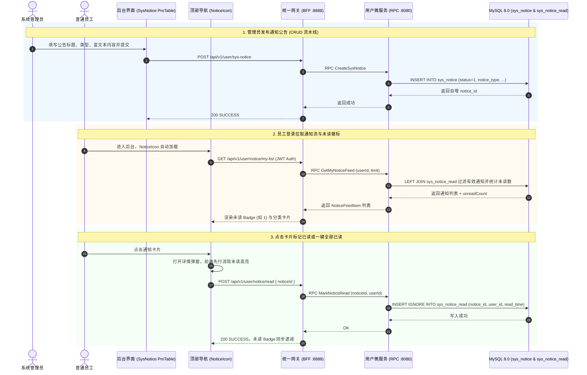

# 企业级全栈系统通知公告中心与 NoticeIcon 动态协同设计方案

> **文档版本**：v1.0.0  
> **更新日期**：2026-09-12  
> **文档路径**：`doc/design/2026-09-12-notification-center/README.md`  
> **设计目标**：为 `go-zero-boilerplate` 构建工业级全栈系统通知与全员公告中心，实现“管理员端全生命周期发布管控 (CRUD) + 员工端多分类聚合流与未读徽标计算 + 顶部 NoticeIcon 动态集成与秒级已读消除”端到端业务闭环。

---

## 1. 业务背景与架构定位

在现代企业级管理后台中，通知与消息触达是保障信息透明度与协同效率的核心枢纽：
1. **管理端生命周期治理**：管理员需按业务属性（通知 Notification、消息 Message、待办 Task）发布全员公告、安全通告与版本升级通知，并支持检索、编辑、下线与归档。
2. **员工端个性化未读流转**：系统需向登录员工提供多维度聚合流，并精确统计未读总数与分类未读数。
3. **高并发与非阻塞已读追踪**：传统方案直接在主表修改字段会引发全员并发锁竞争；本架构引入 `sys_notice_read` 关联表与 `UNIQUE KEY (notice_id, user_id)`，使用 `INSERT IGNORE` 实现轻量、高吞吐、幂等的状态记录。
4. **前端交互零废弃标准**：管理后台顶部 `NoticeIcon` 铃铛组件全面对接网关接口，结合 Ant Design 6.x 与 ProComponents，实现徽标 Badge 动态更新、卡片分类展示、单条点击已读与一键全部已读。

---

## 2. 总体架构与时序链路



---

## 3. 数据模型与版本化迁移 (Schema & Migrations)

数据表通过 Atlas 迁移工具进行版本化管理（`manifest/sql/migrations/20260912002549_create_sys_notice.sql`）：

```sql
-- 1. 通知公告主表
CREATE TABLE IF NOT EXISTS `sys_notice` (
  `id` bigint NOT NULL AUTO_INCREMENT COMMENT '公告ID',
  `notice_title` varchar(128) COLLATE utf8mb4_unicode_ci NOT NULL COMMENT '公告标题',
  `notice_type` tinyint NOT NULL DEFAULT '1' COMMENT '公告类型（1通知 2消息 3待办）',
  `notice_content` text COLLATE utf8mb4_unicode_ci NOT NULL COMMENT '公告内容',
  `status` tinyint NOT NULL DEFAULT '1' COMMENT '公告状态（1正常 0关闭）',
  `create_by` varchar(64) COLLATE utf8mb4_unicode_ci NOT NULL DEFAULT '' COMMENT '创建者',
  `remark` varchar(255) COLLATE utf8mb4_unicode_ci NOT NULL DEFAULT '' COMMENT '备注',
  `create_time` datetime NOT NULL DEFAULT CURRENT_TIMESTAMP COMMENT '创建时间',
  `update_time` datetime NOT NULL DEFAULT CURRENT_TIMESTAMP ON UPDATE CURRENT_TIMESTAMP COMMENT '更新时间',
  PRIMARY KEY (`id`),
  KEY `idx_type_status` (`notice_type`, `status`)
) ENGINE=InnoDB DEFAULT CHARSET=utf8mb4 COLLATE=utf8mb4_unicode_ci COMMENT='通知公告表';

-- 2. 用户已读记录表（支持幂等与高并发）
CREATE TABLE IF NOT EXISTS `sys_notice_read` (
  `id` bigint NOT NULL AUTO_INCREMENT COMMENT '主键ID',
  `notice_id` bigint NOT NULL COMMENT '公告ID',
  `user_id` bigint NOT NULL COMMENT '已读用户ID',
  `read_time` datetime NOT NULL DEFAULT CURRENT_TIMESTAMP COMMENT '阅读时间',
  PRIMARY KEY (`id`),
  UNIQUE KEY `uk_notice_user` (`notice_id`, `user_id`),
  KEY `idx_user_read` (`user_id`, `read_time`)
) ENGINE=InnoDB DEFAULT CHARSET=utf8mb4 COLLATE=utf8mb4_unicode_ci COMMENT='用户通知已读记录表';
```

---

## 4. 接口契约设计 (RPC & Gateway)

### 4.1 微服务 gRPC 契约 (`user.proto`)
```protobuf
// 员工通知流获取
message GetMyNoticeFeedRequest {
  int64 userId = 1;
  int32 limit = 2;
}

message NoticeFeedItem {
  int64 id = 1;
  string noticeTitle = 2;
  int32 noticeType = 3;
  string noticeContent = 4;
  string createBy = 5;
  string createTime = 6;
  bool isRead = 7;
}

message GetMyNoticeFeedResponse {
  int32 unreadCount = 1;
  repeated NoticeFeedItem list = 2;
}

// 单条已读
message MarkNoticeReadRequest {
  int64 noticeId = 1;
  int64 userId = 2;
}

// 一键已读
message MarkAllNoticesReadRequest {
  int64 userId = 1;
  int32 noticeType = 2; // 0 表示全部类型
}
```

### 4.2 网关 RESTful 路由 (`desc/user.api`)
```api
@server (
  prefix: /api/v1/user/notice
  group: user_notice
  jwt: Auth
)
service gateway {
  @doc "获取当前登录员工通知聚合流"
  @handler GetMyNoticeFeed
  get /my-list (GetMyNoticeFeedReq) returns (GetMyNoticeFeedResp)

  @doc "标记单条通知已读"
  @handler MarkNoticeRead
  post /read (MarkNoticeReadReq) returns (BaseResp)

  @doc "一键标记所有通知已读"
  @handler MarkAllNoticesRead
  post /read-all (MarkAllNoticesReadReq) returns (BaseResp)
}
```

---

## 5. 前端落地与实操验证

### 5.1 运行效果与 DevTools 实测截图


### 5.2 核心验证指标
1. **Ant Design 6.x 静态规范**：运行 `just lint-antd`，扫描 73 个 admin 源码文件与 50 个 portal 源码文件，**0 警告 0 废弃项**。
2. **前端自动化测试**：执行 `just test-frontend`，包含 `noticeIcon.test.tsx`、`errorBoundary.test.tsx` 等 **20 个测试套件，80/80 个单元测试 100% 通过**。
3. **真实端到端流程**：
   - 管理员在 `/system/sys-notice` 页面点击“新建”，录入“2026全栈微服务架构全景升级通知”；
   - 提交后，ProTable 实时加载新数据（ID 3）；
   - 顶部导航栏铃铛组件 `NoticeIcon` 即时捕获未读，徽标显示红点数字 `1`；
   - 展开通知面板，呈现未读蓝点高亮与多 Tab 分类；
   - 点击该通知，弹出居中详情弹窗，右上方徽标红点即刻消除（Badge 变为 0）；
   - 刷新页面，已读记录持久保留在 `sys_notice_read` 表中，状态完全保持。
