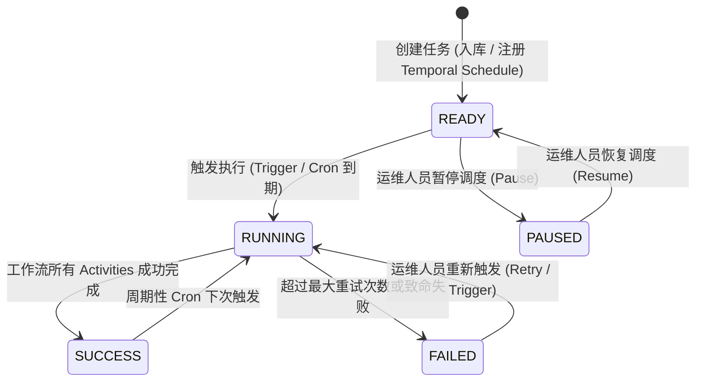

# Temporal 分布式工作流编排与异步任务治理系统设计方案 (Worker RPC & sys_async_task)

本文档记录 `go-zero-boilerplate` 中台微服务体系中 **Temporal 分布式任务引擎集成**、**异步任务治理中心 (`sys_async_task`)**、**管理后台任务全生命周期运维页面** 以及 **脚手架架构纯净化** 的整体设计方案与工程落地细节。

---

## 1. 架构总览与设计哲学

在现代化微服务与中台系统中，存在两类典型工作负载：
1. **轻量在线请求 (OLTP)**：用户登录、权限查询、基础配置修改，要求数十毫秒内快速返回。
2. **长耗时/可靠性异步任务 (Async Workflow & Saga)**：报表生成、数据清洗、多微服务跨库分布式事务、定时批量调度。此类任务若在在线网关中执行，极易导致 HTTP 连接超时、线程池耗尽或网络抖动导致的分布式数据不一致。

为解决上述挑战，系统引入 **Temporal 工作流编排引擎** 并构建独立的 **Worker 微服务** (`app/worker`)：

```text
                                 +---------------------------------------+
                                 |         Admin Web Console (React)     |
                                 |          /system/tasks 任务管理中心    |
                                 +-------------------+-------------------+
                                                     | HTTP RESTful
                                                     v
                                 +---------------------------------------+
                                 |        Gateway / BFF (:8888)          |
                                 |   /api/v1/system/task/* 路由治理切面   |
                                 +-------------------+-------------------+
                                                     | gRPC
                                                     v
                                 +---------------------------------------+
                                 |          Worker RPC (:8082)           |
                                 | - 任务元数据落库 (sys_async_task)      |
                                 | - 状态机流转 (READY/RUNNING/SUCCESS)  |
                                 | - Temporal Schedule 动态调度管理器    |
                                 +---------+-------------------+---------+
                                           |                   ^
                     Schedule / Start      |                   | Activity Run / State Callback
                                           v                   |
               +-----------------------------------+           |
               |      Temporal Server (:7233)      |-----------+
               |  - 内置调度引擎 (Schedule API)    |
               |  - 事件溯源 (Event History)       |
               |  - 自动指数退避重试 (Exponential) |
               +-----------------------------------+
```

### 核心设计原则
- **职责边界绝对隔离**：统一网关（Gateway）仅负责鉴权与路由分发，严禁网关直接持有 Temporal 客户端或直连数据库。网关统一经由标准 gRPC 调用 `WorkerRpc`。
- **契约解耦 (`app/worker/contract`)**：网关与跨业务微服务仅依赖轻量级任务契约（Task Queue 名、Signal 信号、Workflow ID 规范与结构体定义），无需依赖 Worker 内部具体业务实现。
- **双重生命周期保障 (Database + Temporal)**：所有任务均在 MySQL `sys_async_task` 完整落库记录执行历史、Cron 表达式、耗时与错误信息；同时在 Temporal 侧注册 Schedule 实现高可用分布式定时触发与事件溯源。

---

## 2. 数据持久层与状态机设计

### 2.1 任务实体表结构 (`sys_async_task`)
位于 `manifest/sql/migrations/20260913150000_create_sys_async_task.sql`：

```sql
CREATE TABLE IF NOT EXISTS `sys_async_task` (
    `id` BIGINT NOT NULL AUTO_INCREMENT COMMENT '主键ID',
    `task_name` VARCHAR(128) NOT NULL COMMENT '任务名称',
    `task_type` VARCHAR(64) NOT NULL COMMENT '任务类型/工作流标识 (如 daily_report_generate)',
    `task_queue` VARCHAR(64) NOT NULL DEFAULT 'ASYNC_TASK_QUEUE' COMMENT 'Temporal 任务队列',
    `cron_expr` VARCHAR(64) NOT NULL DEFAULT '' COMMENT 'Cron 调度表达式 (为空则为手动单次触发)',
    `params` TEXT COMMENT '任务执行输入参数 (JSON)',
    `status` VARCHAR(32) NOT NULL DEFAULT 'READY' COMMENT '状态: READY(就绪), RUNNING(运行中), SUCCESS(成功), FAILED(失败), PAUSED(已暂停)',
    `workflow_id` VARCHAR(128) NOT NULL DEFAULT '' COMMENT 'Temporal Workflow/Schedule ID',
    `last_run_time` DATETIME NULL COMMENT '最近一次运行时间',
    `next_run_time` DATETIME NULL COMMENT '预计下次运行时间',
    `retry_count` INT NOT NULL DEFAULT 0 COMMENT '重试次数',
    `error_msg` TEXT COMMENT '错误/异常信息',
    `created_by` VARCHAR(64) NOT NULL DEFAULT '' COMMENT '创建人',
    `created_at` DATETIME NOT NULL DEFAULT CURRENT_TIMESTAMP COMMENT '创建时间',
    `updated_at` DATETIME NOT NULL DEFAULT CURRENT_TIMESTAMP ON UPDATE CURRENT_TIMESTAMP COMMENT '更新时间',
    PRIMARY KEY (`id`),
    KEY `idx_task_type` (`task_type`),
    KEY `idx_status` (`status`)
) ENGINE=InnoDB DEFAULT CHARSET=utf8mb4 COLLATE=utf8mb4_unicode_ci COMMENT='异步任务与工作流调度管理表';
```

### 2.2 状态机演进图 (Task State Machine)


---

## 3. Worker 微服务与 Temporal SDK 集成

### 3.1 客户端连接池与日志适配 (`pkg/temporalx`)
- **连接池抽象**：在 `pkg/temporalx/client.go` 中封装 Temporal Go SDK 客户端初始化，支持多节点寻址与自动化保活。
- **logx 统一日志桥接**：实现 `temporal.Logger` 接口并适配为 go-zero 标准 `logx` 结构化日志，保证 Temporal 底层事件输出与整个后端链路追踪一致。

### 3.2 工作流与活动实现 (`app/worker/rpc/internal/`)
1. **工作流实现 (Workflows)**：如 `DailyReportWorkflow`，基于 `workflow.ExecuteActivity` 顺序调度数据拉取与报表聚合，配置指数退避重试策略（`InitialInterval: 1s`, `BackoffCoefficient: 2.0`, `MaximumAttempts: 5`）。
2. **活动执行器 (Activities)**：执行具体数据提取与文件生成，具备原子性。
3. **Temporal Schedule 动态管理**：
   - 任务创建时若包含 `cron_expr`，自动调用 `temporalClient.ScheduleClient().Create` 注册为 Temporal Schedule。
   - 暂停时调用 `scheduleHandle.Pause(ctx, ...)`，恢复时调用 `scheduleHandle.Unpause(ctx, ...)`。
   - 手动触发时调用 `scheduleHandle.Trigger(ctx, ...)` 或直接派发一次性 `ExecuteWorkflow`。

---

## 4. 全栈前后端治理中心

### 4.1 网关层 (`app/gateway`)
在 `app/gateway/desc/task.api` 声明标准 RESTful 接口并在网关 Logic 中转发至 Worker RPC：
- `POST /api/v1/system/task/list`：多条件分页检索异步任务。
- `POST /api/v1/system/task/create`：新增异步任务，同步登记 Temporal 调度器。
- `PUT /api/v1/system/task/update`：编辑任务配置（Cron 表达式、参数、队列）。
- `DELETE /api/v1/system/task/delete`：删除任务并注销 Temporal 调度。
- `POST /api/v1/system/task/pause`：暂停调度器。
- `POST /api/v1/system/task/resume`：恢复调度器。
- `POST /api/v1/system/task/trigger`：立即手动触发一次执行。

### 4.2 管理后台前端 (`frontend/apps/admin`)
- **路径**：`/system/tasks`（菜单：“系统管理 -> 任务管理”）。
- **组件**：基于 Ant Design ProTable 构建，内置任务状态 Badge（彩色徽标）、运行时间格式化、以及操作区（“立即执行”、“暂停”、“恢复”、“编辑”、“删除”）。
- **表单交互**：采用 `ModalForm` + `ProFormText` / `ProFormTextArea`，内置 Cron 表达式语法说明与默认推荐值。

### 4.3 侧边栏辅助链接与 OpenAPI 规范
- 对齐官方 `ant-design/ant-design-pro (all-blocks)` 标准：
  - 侧边栏底部通过 ProLayout 原生 `links` 挂载 `<LinkOutlined /> OpenAPI 文档`。
  - 底部版权收归为极简 `menuFooterRender`，折叠时自动收缩，保持侧边栏干净与留白一致。

---

## 5. 脚手架架构纯净化 (Decommission of Order Service)

为保证开源脚手架的核心定位（聚焦于身份认证、RBAC 权限、双日志审计、异步任务调度、通用存储等企业级基础设施）：
1. **完全下线业务专属的 `app/order` 模块**：删除了订单 RPC、订单表 DDL (`order.sql`) 及前端订单页面，避免引入特定业务概念。
2. **大盘监控改造 (`/dashboard`)**：系统大盘完全转为通用平台指标展示，通过 `mr.Finish` 并发聚合 User 微服务与 Worker 异步任务引擎的运行健康状态与吞吐指标。
