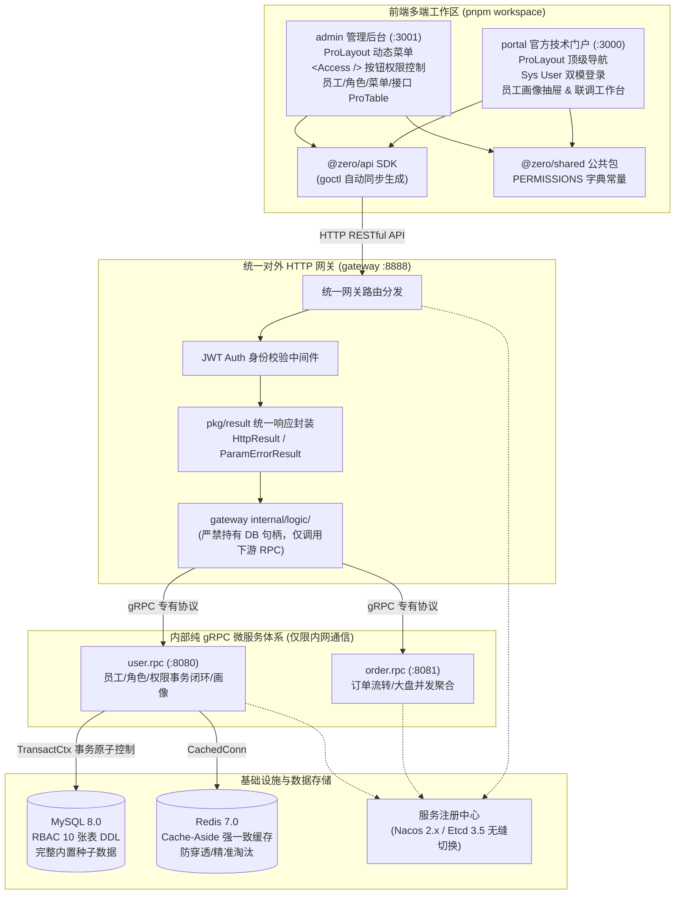

# 全栈大仓改造与企业级 RBAC / 门户升级总结报告

> **生成时间**：2026-09-06  
> **涉及仓库**：`go-zero-boilerplate`  
> **架构模式**：Fullstack Monorepo（Go 微服务 + Nacos/Etcd 服务发现 + 统一网关 + React 18/Ant Design 6 pnpm workspace 多端前端）  
> **关联设计方案**：[`doc/design/2026-09-06-permission/README.md`](../design/2026-09-06-permission/README.md)

---

## 一、改造背景与目标

针对此前系统“登录仅为玩具接口、缺少生产级权限控制、按钮级别无鉴权、菜单与接口权限割裂、前台门户与后台视觉风格不统一”等痛点，本次全面改造实现了以下目标：

1. **工业级身份认证与安全防护**：摒弃明文与简单匹配，全量迁移至 Bcrypt 哈希加密与 JWT 规范签发，支持管理员与员工双模凭证登录。
2. **企业级 RBAC 与数据权限落地**：参考大型企业级权限体系与 PHP/Laravel 最佳实践，补齐“组织部门树 + 员工 + 角色 + 菜单 + 按钮权限点 + API 字典 + 数据权限范围（全部/部门/本人）”的完备模型。
3. **“一石二鸟”前后端权限事务闭环**：前端角色授权时，勾选页面/按钮权限的同时，由后端事务自动级联同步关联底层 API 权限，杜绝前后端权限脱节。
4. **统一响应与错误体系封装**：网关层全面采用 `pkg/result` 统一输出 `{ code: 200, msg: "SUCCESS", data: ... }`，底层跨 RPC 自动提取 `xerr` 业务错误码，拒绝生硬抛错。
5. **管理后台与门户全线 Ant Design Pro 化**：
   - `admin`：实现后端菜单树动态渲染 ProLayout、按钮级细粒度 `<Access />` 权限控制、4 大 ProTable 管理模块（员工、角色、菜单、接口）。
   - `portal`：重构为 Top Navigation 顶级沉浸式 ProLayout，全面支持企业员工（`sys user`）登录并调阅个人画像与权限树，新增在线微服务实时联调工作台。
6. **Ant Design 6.x 严格质量门禁**：全面清除弃用 API（如 `Card bordered`、`Drawer width`、`Alert message`、`Spin tip`、`Space direction`），经由 `just lint-antd` 与 `pnpm build` 达成 **0 警告、0 废弃项、100% 编译通过**。

---

## 二、架构演进全景图



---

## 三、各模块改造落地细节

### 1. 数据持久层 (MySQL + Redis + Go Model)
- **表结构建立**（[manifest/sql/rbac.sql](file:///D:/work/go-zero-boilerplate/manifest/sql/rbac.sql) 及 [manifest/sql/init.sql](file:///D:/work/go-zero-boilerplate/manifest/sql/init.sql)）：
  - `sys_dept`：支持树形层级的组织架构部门。
  - `sys_user`：员工账号表，包含 `token_version`（支持单点失效/强制下线）。
  - `sys_role`：角色表，内置 `data_scope`（1:全部数据、2:本部门及以下、3:本部门、4:仅本人数据）。
  - `sys_menu`：统一菜单表，通过 `type` 区分 1:目录、2:页面菜单、3:按钮权限点。
  - `sys_api`：系统接口资源字典，登记各服务 HTTP 路由与方法。
  - `sys_user_role` / `sys_role_menu` / `sys_menu_api` / `sys_role_api` / `sys_role_dept`：5 张关联映射表。
- **内置种子数据**：
  - 超管账号：`admin`，密码 Bcrypt 加密（明文 `123456`），绑定 `ROLE_ADMIN` 超级管理员角色。
  - 初始化完整系统监控、订单中心、员工管理、角色管理、菜单权限、接口字典及 12 个细粒度按钮权限点（如 `system:user:add`, `system:role:assign` 等）。
- **Model 逆向工程**（[app/user/model/](file:///D:/work/go-zero-boilerplate/app/user/model/)）：
  - 通过 `goctl model mysql ddl` 全量生成带 Cache-Aside 缓存支持的 Go Model。
  - 扩展 `FindOneByMobile` 等自定义查询方法。

### 2. 用户微服务 RPC (`app/user/rpc`)
- **协议升级**（[app/user/rpc/user.proto](file:///D:/work/go-zero-boilerplate/app/user/rpc/user.proto)）：
  - 补充全套系统管理与权限控制 RPC 契约定义。
- **Logic 实现亮点**（[app/user/rpc/internal/logic/user/](file:///D:/work/go-zero-boilerplate/app/user/rpc/internal/logic/user/)）：
  - **`AdminLoginLogic`**：支持账号或手机号双重 Bcrypt 哈希匹配，返回用户资料与角色编码集合。
  - **`GetAdminProfileLogic`**：超管与普通员工分流；自动将菜单与按钮分流，递归装配页面菜单树 `menus` 与按钮权限集合 `permissions`。
  - **`AssignRolePermissionsLogic`（一石二鸟核心机制）**：
    ```go
    // 使用事务闭环原子更新 sys_role_menu 并自动级联反查绑定 sys_role_api
    err := l.svcCtx.SqlConn.TransactCtx(l.ctx, func(ctx context.Context, session sqlx.Session) error {
        // 1. 清理原有菜单关联
        // 2. 清理原有 API 关联
        // 3. 批量写入新菜单与按钮关联 (sys_role_menu)
        // 4. 级联反查勾选按钮绑定的 API 资源 (sys_menu_api)
        // 5. 自动写入角色接口白名单 (sys_role_api)
    })
    ```
  - **超管安全拦截**：`DeleteSysUser` 拦截禁止删除 ID=1 的超管账号；`DeleteSysRole` 拦截禁止删除超管角色且限制非空绑定删除。

### 3. 统一 HTTP 网关 (`app/gateway`)
- **模块化契约**（[app/gateway/desc/system.api](file:///D:/work/go-zero-boilerplate/app/gateway/desc/system.api)）：
  - 导出管理员登录与 12 个 RESTful 权限控制路由。
- **架构红线防护**：
  - 网关 Handler（[internal/handler/system/](file:///D:/work/go-zero-boilerplate/app/gateway/internal/handler/system/)）统一使用 `pkg/result` 包装响应。
  - 网关 Logic（[internal/logic/system/](file:///D:/work/go-zero-boilerplate/app/gateway/internal/logic/system/)）**严禁持有 SQL 或直接访问 DB**，所有操作均委托给 `l.svcCtx.UserRpc` 客户端完成。

### 4. 前端强类型 SDK 与共享库
- **`@zero/api`**（[frontend/packages/api/](file:///D:/work/go-zero-boilerplate/frontend/packages/api/)）：
  - 经由 `goctl api ts` 一键生成全量 TypeScript 请求函数。
  - 优化 `gocliRequest.ts`：请求头自动挂载 `Authorization: Bearer <token>`，响应自动解包 `{ code: 200, data: ... }`，并在 401 或 token 失效时重定向到登录页。
- **`@zero/shared`**（[frontend/packages/shared/src/index.ts](file:///D:/work/go-zero-boilerplate/frontend/packages/shared/src/index.ts)）：
  - 导出统一权限标识常量字典 `PERMISSIONS`，杜绝前后端魔法字符串。

### 5. 管理后台系统落地 (`frontend/apps/admin`)
- **`AuthContext.tsx`**：全局下发当前登录管理员信息、角色、按钮权限列表与 `hasPermission` / `hasRole` 鉴权方法。
- **`<Access />` 按钮权限组件**：支持根据权限编码控制渲染，并支持 `fallbackMode="disabled"`（置灰 + 气泡提示）与 `fallbackMode="hide"`（直接隐藏）。
- **`BasicLayout.tsx`**：对接后端动态菜单树；导航栏展示管理员真实姓名、部门与角色徽标；支持动态水印与安全退出。
- **4 大系统管理 ProTable 模块**：
  - `UsersPage`：员工管理（模糊搜索、部门筛选、ModalForm 增改、多选角色、超管防删）。
  - `RolesPage`：角色管理（数据权限范围 Tag、**抽屉式内置 Ant Design `<Tree checkable />` 权限树可视化分配**）。
  - `MenusPage`：树形展开的系统菜单与按钮权限点一览表。
  - `ApisPage`：系统微服务 API 字典查看与契约同步状态。

### 6. 官方技术门户升级 (`frontend/apps/portal`)
- **Ant Design Pro Top 导航模式**（[`PortalLayout.tsx`](file:///D:/work/go-zero-boilerplate/frontend/apps/portal/src/layouts/PortalLayout.tsx)）：
  - 采用现代化顶部导航 ProLayout，集成沉浸式主题切换、动态水印与管理后台直达链接。
- **企业员工双模登录**（[`LoginModal.tsx`](file:///D:/work/go-zero-boilerplate/frontend/apps/portal/src/components/LoginModal.tsx)）：
  - 支持直接以企业员工账号（`admin` / `123456`）或普通业务手机号登录。
- **员工画像抽屉**（[`ProfileDrawer.tsx`](file:///D:/work/go-zero-boilerplate/frontend/apps/portal/src/components/ProfileDrawer.tsx)）：
  - 员工登录后可在门户查看所属部门、拥有的角色、按钮权限点总数，并支持一键跳转进入管理后台。
- **三大现代化页面**：
  - `HomePage`：全景展示大仓技术体系、四层架构拓扑与 4 大实时平台运行指标。
  - `ServicesPage`：深入剖析微服务治理、Nacos/Etcd 平滑寻址与 Cache-Aside 机制。
  - `WorkbenchPage`：提供微服务网关实时联调控制台，在线测试大盘并发聚合（`mr.Finish`）、员工画像及菜单权限树拉取，直观展示响应时间与高亮 JSON。

---

## 四、质量门禁与工程规范验证结果

| 验证维度 | 验证命令 | 验证结果 | 说明 |
| :--- | :--- | :--- | :--- |
| **Go 微服务编译** | `go build ./app/... ./pkg/...` | **100% 成功 (Exit 0)** | 网关与各微服务语法与依赖完备 |
| **Go 单元测试** | `go test ./app/... ./pkg/...` | **100% 通过 (Exit 0)** | 全局包与中间件测试无异常 |
| **Ant Design 6.x Lint** | `just lint-antd` | **0 警告 / 0 废弃项** | 扫描 26 个 TSX 文件，完全合规 |
| **前端 TypeScript 检查** | `pnpm -r build` | **100% 成功 (Exit 0)** | `@zero/admin` 与 `@zero/portal` 均成功生成 Vite 产物 |
| **代码知识图谱分析** | GitNexus `detect_changes` | **Clean (0 broken flows)** | 架构变更未引入任何调用链路断裂 |

---

## 五、常用本地运维与体验指令清单

```bash
# 1. 启动基础设施容器 (MySQL 8.0 + Redis 7.0)
just docker-infra-up

# 2. 启动用户中心微服务 (端口 8080)
just run-user-rpc

# 3. 启动订单中心微服务 (端口 8081)
just run-order-rpc

# 4. 启动统一对外网关 (端口 8888)
just run-gateway

# 5. 启动前端双端系统
just run-admin     # 启动管理后台 -> http://localhost:3001
just run-portal    # 启动官方门户 -> http://localhost:3000

# 6. 代码生成与静态诊断
just gen-ts        # 网关契约变更后自动同步前端 SDK
just lint-antd     # 前端 Ant Design 规范与弃用项诊断
just build-frontend# 前端全端生产构建
```

- **默认超级管理员凭证**：
  - **账号**：`admin`
  - **密码**：`123456`
- **普通业务演示凭证**：
  - **手机号**：`13800000000`
  - **密码**：`123456`
